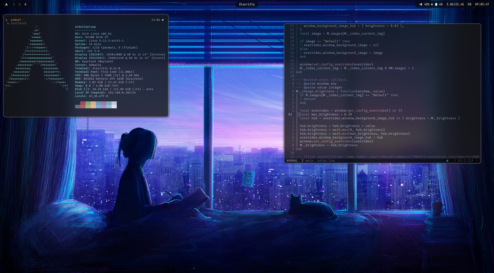

# My dotfiles



## Contents

- neovim config
- tmux config
- wayland ecosystem (for arch)

## 📂 Structure

```plaintext
.
├── alacritty/            # Alacritty terminal configuration
├── git/                  # Git configuration
├── hypr/                 # Hyprland window manager configuration
├── nvim/                 # Neovim configuration
├── starship/             # Starship prompt configuration
├── tmux/                 # Tmux configurations
├── waybar/               # Waybar (status bar) configuration for Wayland
└── zsh/                  # Zsh configuration
```

## Requirements

- `stow` for managing symlinks
- For Arch Linux:
  - x86-64 architecture
  - [yay](https://github.com/Jguer/yay) or another AUR helper
- For macOS:
  - [Homebrew](https://brew.sh)

## Installation

**WIP**

```

cd ~
git clone https://github.com/ardxel/.dotfiles.git
cd .dotfiles
stow .

```

### macOS

```

brew bundle --file=~/.dotfiles/packages/macos/Brewfile

```

### Arch Linux

```

sudo pacman -S --needed - < ~/.dotfiles/packages/arch/pacman.pkglist
yay -S --needed - < ~/.dotfiles/packages/arch/aur.pkglist

```

## Contributing

go ahead and make a pull request.
